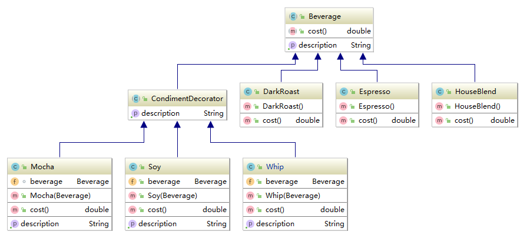

## 装饰者模式
**动态地将责任附加到对象上。若要扩展功能，装饰者提供了比继承更有弹性的替代方案。**
### 类图

### 使用方法
* 装饰者和被装饰对象有相同的超类。
* 你可以用一个或多个装饰者包装一个对象。
* 既然装饰者和被装饰者对象有相同的超类型，所以在任需要原始对象（被包装）的场合，可以用装饰过的对象代替它。
* 装饰者可以在所委托被装饰者的行为之前/之后，加上自己的行为，以达到特定的目的。
* 在本例中，``Beverage``是一个抽象类，它有四个直接子类，其中``CondimentDecorator``是装饰者类，所有的装饰者都要继承这个类
另外的3各类就是具体的对象，是被装饰者。从这个类图中，我们们看到装饰者与被装饰者都有共同的超类。此外还要注意装饰者中
的“装饰方法”，在本例中是：**cost()**.以``whip``为例：

```java
public class Whip extends CondimentDecorator{
    public Beverage beverage;
    public Whip(Beverage beverage){
        this.beverage = beverage;
    }
    public String getDescription() {
        return beverage.getDescription() + ", Whip";
    }
    public double cost() {
        return .20 + beverage.cost();
    }
}
```
本例的情景是顾客要点饮料，而饮料有各种各样的配料，如何计算出一个饮料最终的价格。注意到``Whip``类的实例化必须要传
入一个``Veverage``的对象。在计算Whip这个配料的价格时，会先调用被包装类的 **Cost()** 方法。这就装饰者模式的核心。
### 使用场景
* java I/O 中大量使用了装饰者模式
### 用到的设计原则
* 类应该对扩展开放，对修改关闭
