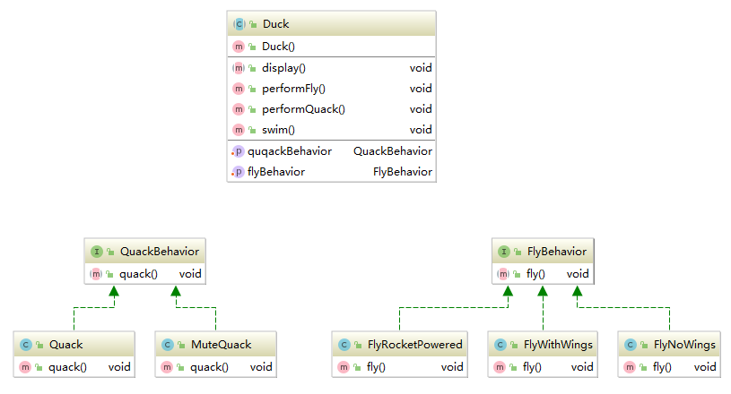

## 策略模式（Strategy）
**策略模式定义了算法族，分别封装起来，让它们之间可以相互替换，此模式让算法的变化独立于使用算法的客户。**
### 类图

类图中的Duck类是一个抽象类。它有两个引用属性，他们是两个接口。这个两个接口分别代表了两个不同的，
会变化的行为。在继承Duck类时我们才指定这个两个接口的实现类，这样一来就可以在不改变代码的情况下，
动态的改变一个类的行为了。后期，也能方便的添加一个行为的新实现。
### 使用方法
* 策略模式就是一种面向接口编程的经典案例。运用这个设计模式的关键在于**找到类中的变化的部分**，把它封装起来。
* 把变化的部分离开，变成一个个的接口(本例中把鸭子叫与鸭子飞分离出来，因为不同的鸭子有不同的叫法)
### 使用场景
* 遇到一个类在不同情况下有不同的行为、动态改变行为登情况时，可以考虑策略莫斯。
### 用到的设计原则
* 针对接口编程，而不是针对实现编程
* 找出应用中可能需要变化之处，把它们独立出来，不要和那些不需要变化的代码混在一起
* 多用组合，少用继承
* 封装变化
